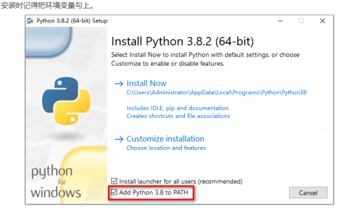
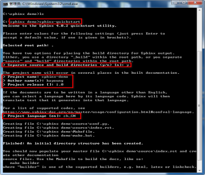
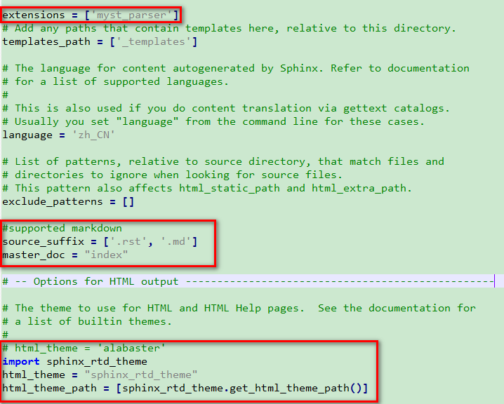
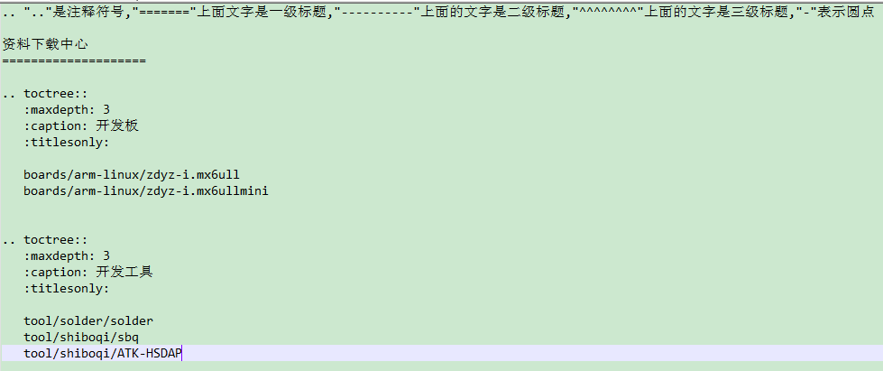
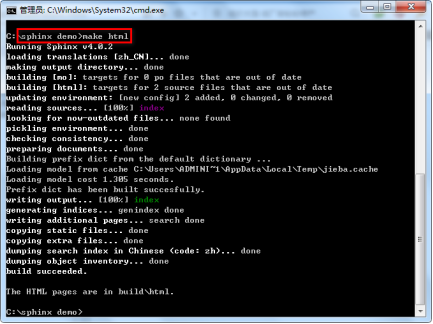
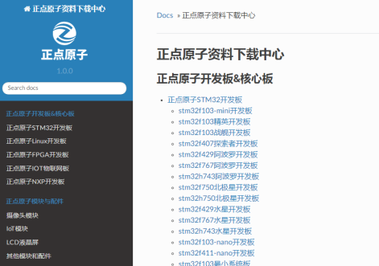

.. 标题文字下的符号长度都要大于标题长度

优雅的管理和编写文档
==========================
Sphinx + GitHub + ReadtheDocs 作为文档写作工具，用 Sphinx 生成文档，GitHub 托管文档，再导入到 ReadtheDocs。

1.安装python3
------------------
链接：https://www.python.org/

  
2.打开电脑命令行, 通过python的pip安装sphinx。
-----------------------------------------------
①　python -m pip install --upgrade pip
②　pip install -i https://pypi.tuna.tsinghua.edu.cn/simple sphinx
③　pip install -i https://pypi.tuna.tsinghua.edu.cn/simple sphinx sphinx-autobuild sphinx_rtd_theme
(或pip install sphinx sphinx-autobuild sphinx_rtd_theme)

3.创建模板.
-------------------
①　创建一个文件夹,如sphinx_demo，在命令行中跳到此文件夹内
②　输入sphinx-quickstart，执行创建模板

	
③　此时在文件夹内有build、source两个文件夹和make.bat、Makefile两个文件。build文件夹是编译后的文件，可以随时删除，编译后重新生成。source则是源文件目录。

4.配置模板，修改source/conf.py
-----------------------------------

5.添加内容文章。
------------------------------------------------
在source目录下新建目录和内容。

6.修改index.rst。  
-------------------------------------------------
添加前面增加的内容目录。

	
一列等号上的是标题，生成的html网页会看到。中间这段是主题，一个sphinx可以有多个主题。
maxdepth指定目录显示的标题深度，通常选择1。caption是主题的名称。空一行，紧跟着就是这个主题包含的源文件。

7.执行make html进行编译。
------------------------------
成功后查看build目录，在html文件夹中有一个index.html文件，用浏览器打开。

	

8. 删除buil目录，然后整上传github
---------------------------------------
	
9. Github托管
----------------------------------
先在GitHub创建一个仓库，然后在本地进行同步，添加远程仓库。
参考官方文档：https://github.com/rtfd/readthedocs.org

10.ReadtheDocs托管
--------------------------
在Read the Docs上面注册一个账号(https://readthedocs.org/)
登陆后点击 “Import”.给该文档项目填写一个名字比如 “scrapy-cookbook”, 并添加你在GitHub上面的工程HTTPS链接, 选择仓库类型为Git
其他项目根据自己的需要填写后点击 “Create”，创建完后会自动去激活Webhooks，不用再去GitHub设置，一切搞定，
从此只要你往这个仓库push内容，readthedoc上面的文档就会自动更新.(https://notes-center.readthedocs.io/zh_CN/latest/#)

