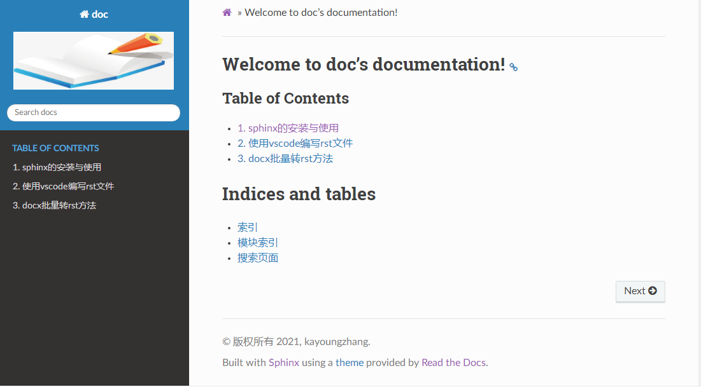

Sphinx + reST + github + ReadtheDocs编写文档
=========================================================

.. contents:: :local:

前言
------

使用标记语言(Markup Language)写文档是当前比较流行的文档编写方式，
目前标记语言主要有两种，Markdown和reStructuredText（简称reST)。
很多开源项目的文档就是用Sphinx+reST做的，上传到github和ReadtheDocs，
通过浏览器就可以直接查看带有格式的文档了。结合网上众多教程，总结了以下使用教程。

安装软件包
-------------

- 安装 `python3 <https://www.python.org/>`_,并添加bin目录到环境变量中。
- 安装 `git 软件 <https://git-scm.com/download>`_，并添加bin目录到环境变量中。
- 通过pip工具安装 `sphinx工具`_,
  ``pip install -U Sphinx`` 或 
  ``pip install -i https://pypi.tuna.tsinghua.edu.cn/simple sphinx`` 
- 安装 `Sphinx Themes`_, 这里选择 `第三方主题`_ "Read the Docs", 
  ``pip install sphinx sphinx-autobuild sphinx_rtd_theme`` 或
  ``pip install -i https://pypi.tuna.tsinghua.edu.cn/simple sphinx sphinx-autobuild sphinx_rtd_theme``

.. _sphinx工具: https://www.sphinx-doc.org/en/master/index.html
.. _Sphinx Themes: https://www.sphinx-doc.org/en/master/usage/theming.html#builtin-themes
.. _第三方主题: https://sphinx-themes.org/

建立项目
--------

- 新建文件夹，运行cmd命令行，进入此文件夹中，这里为doc_demo, 然后运行 `sphinx-quickstart`，
  之后sphinx会出现如下输出，根据需要输入即可。这里我建立了一个doc的Project，版本是1.0，
  作者名为kayoungzhang，语言为zh_CN,将source与build目录分开。
  
::
	
	Microsoft Windows [版本 6.1.7601]
	版权所有 (c) 2009 Microsoft Corporation。保留所有权利。

	C:\Users\Administrator>cd doc_demo

	C:\Users\Administrator\doc_demo>sphinx-quickstart
	Welcome to the Sphinx 3.5.4 quickstart utility.

	Please enter values for the following settings (just press Enter to
	accept a default value, if one is given in brackets).

	Selected root path: .

	You have two options for placing the build directory for Sphinx output.
	Either, you use a directory "_build" within the root path, or you separate
	"source" and "build" directories within the root path.
	> Separate source and build directories (y/n) [n]: y

	The project name will occur in several places in the built documentation.
	> Project name: doc
	> Author name(s): kayoungzhang
	> Project release []: 1.0

	If the documents are to be written in a language other than English,
	you can select a language here by its language code. Sphinx will then
	translate text that it generates into that language.

	For a list of supported codes, see
	https://www.sphinx-doc.org/en/master/usage/configuration.html#confval-language.
	> Project language [en]: zh_CN

	Creating file C:\Users\Administrator\doc_demo\source\conf.py.
	Creating file C:\Users\Administrator\doc_demo\source\index.rst.
	Creating file C:\Users\Administrator\doc_demo\Makefile.
	Creating file C:\Users\Administrator\doc_demo\make.bat.

	Finished: An initial directory structure has been created.

	You should now populate your master file C:\Users\Administrator\doc_demo\source\
	index.rst and create other documentation
	source files. Use the Makefile to build the docs, like so:
	make builder
	where "builder" is one of the supported builders, e.g. html, latex or linkcheck.

	C:\Users\Administrator\doc_demo>

- doc_demo文件夹中出现一些文件：
  
  + source和build分别是源文件目录和编译生成文件的存放目录，
  + Makefile和make.bat分别是Linux和Windows下的makefile。
  + conf.py是配置文件，index.rst是配置文档显示结构，_static是静态文件存放目录，_templates是模板存放目录。

conf.py配置
-------------

* 主题样式
  在conf.py中,屏蔽默认的主题，并添加新的主题::

	# html_theme = 'alabaster'
	import sphinx_rtd_theme
	html_theme = "sphinx_rtd_theme"

* LOGO设置,准备好logo图片::
	
	html_logo = './logo.png'

* 不显示源文件链接::
	
	html_show_sourcelink = False

* 支持markdown编辑 ``安装myst-parser包及recommonmark包 (pip install myst-parser，pip install recommonmark)``

::

	extensions = ['myst_parser']

	from recommonmark.parser import CommonMarkParser
	source_parsers = {
			'.md': CommonMarkParser,
	}

	source_suffix = ['.rst', '.md']

* 支持markdown 表格 ``安装sphinx-markdown_tables包(pip install sphinx-markdown_tables)``

::

	extensions = [‘myst_parser’, ‘sphinx_markdown_tables’]

创建rst文件
---------------------

根据自己的需要创建，这里是在source文件夹中创建sphinx.rst和vscode.rst文档，同时新建文件夹docxtorst.rst,
并在其中创建docxtorst.rst文档。并在其中添加标题和内容。

index.rst中TOC tree设置
----------------------------------------

::

	.. toctree::
	   :maxdepth: 2
	   :caption: Table of Contents
	   :titlesonly:
	   :numbered:

	   sphinx
	   vscode
	   docxtorst/docxtorst

.. note:: 
	- maxdepth -> 目录中可显示标题的最多级数，不添加则会显示文档中所有标题
	- caption -> toctree显示标题
	- titleonly ->只想显示toctree文档标题，而不显示同一级别的其他标题
	- numbered -> 给罗列的文档标题进行显示标号，子目录也会自动编号
	- sphinx、vscode ->当前index.rst文档所在目录下的sphinx.rst和vscode.rst文档
	- docxtorst/docxtorst -> docxtorst文件夹下的docxtorst.rst文档

运行 `make html` 编译生成html文件,并在build文件夹的html文件夹下
打开html文件即可看到具体的网页实现::

	C:\Users\Administrator\doc_demo>make html
	Running Sphinx v3.5.4
	loading translations [zh_CN]... done
	loading pickled environment... done
	myst v0.14.0: MdParserConfig(renderer='sphinx', commonmark_only=False, dmath_all
	ow_labels=True, dmath_allow_space=True, dmath_allow_digits=True, dmath_double_in
	line=False, update_mathjax=True, enable_extensions=['dollarmath'], disable_synta
	x=[], url_schemes=None, heading_anchors=None, html_meta=[], footnote_transition=
	True, substitutions=[], sub_delimiters=['{', '}'], words_per_minute=200)
	building [mo]: targets for 0 po files that are out of date
	building [html]: targets for 1 source files that are out of date
	updating environment: [config changed ('source_parsers')] 4 added, 0 changed, 0
	removed
	reading sources... [100%] vscode
	looking for now-outdated files... none found
	pickling environment... done
	checking consistency... done
	preparing documents... done
	Building prefix dict from the default dictionary ...
	Loading model from cache C:\Users\ADMINI~1\AppData\Local\Temp\jieba.cache
	Loading model cost 1.264 seconds.
	Prefix dict has been built succesfully.
	writing output... [100%] vscode
	generating indices... genindex done
	writing additional pages... search done
	copying images... [100%] docxtorst/media/docxto015.png
	copying static files... done
	copying extra files... done
	dumping search index in Chinese (code: zh)... done
	dumping object inventory... done
	build succeeded.

	The HTML pages are in build\html.

具体效果图：

github或gitee托管
------------------------
  
- 以上的操作，只能在本地的浏览器查看文档，若想让所有人都能看到，需要部署
  到ReadtheDocs展示，在部署之前，要把代码托管到代码托管平台，这里选用github，
  也可以选gitee，国内使用速度快；
- 先到github上建立一个公开的仓库，然后将本地项目文件上传即可，如我是建立一个名为doc的仓库;
- 在上传文件之前，先自己写一个.gitignore文件，用于指示编辑的
- 文件（build目录）不上传到代码仓库，.gitignore文件内容如下：`build/`
- 在本地项目文件夹内使用基本的git指令来将文件上传到仓库。
  
::

	git init
	git add -A
	git commit -m "first commit"
	git remote add origin github上远程库地址
	git push -u origin master

ReadtheDocs托管
-----------------

在 `Read the Docs <https://readthedocs.org/>`_ 上注册一个账号, 
登陆后点击 “Import”.给该文档项目填写一个名字比如 “doc”, 
并添加你在GitHub上面的工程HTTPS链接, 选择仓库类型为Git, 
其他项目根据自己的需要填写,点击 “Create”，创建完后会自动激活Webhooks，
不用再去GitHub设置，从此只要你往这个仓库push内容，readthedoc上面的文档就会自动更新。
可参考readthedocs `官方文档`_。
  
.. _官方文档: https://github.com/rtfd/readthedocs.org

