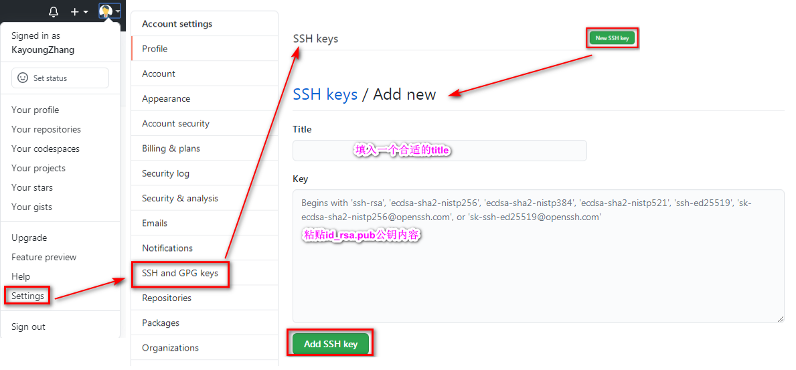
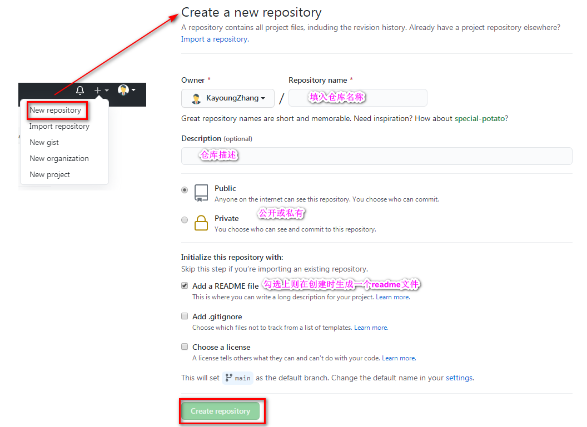

.. 标题文字下的符号长度都要大于标题长度

将本地项目上传到Github
==========================

1. 安装git客户端。
-----------------------

`git官网 <https://git-scm.com/>`_

2. 注册github账户。
------------------------- 

`github官网 <https://github.com/>`_  

`码云官网 <https://gitee.com/>`_

3. 绑定用户。
---------------------
打开gitbash命令行窗口，分别输入::

	git config --global user.name "用户名"
	git config --global user.email "邮箱"

4. 为Github账户设置SSH key
--------------------------------

- ssh key是加密传输。由于本地Git仓库和Github仓库之间的传输是通过SSH加密的，所以连接时需要创建SSH KEY设置一下，先看一下你C盘用户目录下有没有.ssh目录，有的话看下里面有没有id_rsa和id_rsa.pub这两个文件，有就跳到下一步，没有就通过下面命令创建

	`ssh-keygen -t rsa -C "邮箱"`，用记事本打开id_rsa.pub，得到ssh key公钥。

- 进入github网址，Settings -> SSH and GPG keys -> New SSH key -> 填入一个title，再把ssh key公钥内容Key栏中。完成SSH的配置。
 

5. 创建repository(仓库)
------------------------------

6. 创建本地的版本库并进行文件推送。 
-------------------------------------

其实也就是新建一个文件夹。如test。

创建新仓库的指令::

	git init //把这个目录变成Git可以管理的仓库
	git add README.md //文件添加到仓库
	git add . //不但可以跟单一文件，还可以跟通配符，更可以跟目录。一个点就把当前目录下所有未追踪的文件全部add了 
	git commit -m "first commit" //把文件提交到仓库
	git remote add origin https://github.com/KayoungZhang/notes-center.git //关联远程仓库
	git push -u origin master //把本地库的所有内容推送到远程库上

**- 初始化可管控的版本库** :

打开gitbash命令行窗口，输入git init回车，test文件夹中多了.git文件夹，它是Git用来跟踪和管理版本库的。

**- 添加需要上传的文件，并提交到本地库** :

把需要上传到GitHub的文件全部复制到这test这个目录下。然后在bash命令窗口输入git add .(注意这个"."，是有空格的，"."代表这个test这个文件夹下的目录全部都提交。你也可以通过（git add 文件名）提交指定的文件)把文件添加到缓存区，再使用命令git commit -m "这里面写你的注释"  把文件提交的本地仓库。

**- 连接远程仓库（也就是连接Github）** :

在Github上创建好Git仓库之后我们就可以和本地仓库进行关联了::

	git remote add origin github上仓库地址
	
**- 推送内容到远程库** :

关联好之后我们就可以把本地库的所有内容推送到远程仓库（也就是Github）上了,由于新建的远程仓库是空的，所以要加上-u这个参数。如果远程仓库不为空，可以通过 `git pull --rebase origin master` 进行内容合并::

	远程仓库为空，加入 `-u` 这个参数
	git push -u origin master
	
	//远程仓库不为空
	git pull --rebase origin master
	git push origin master

**- 添加修改了内容提交** ：

添加修改后的内容再次进行提交，只需要进行以下操作::

	git add 文件内容名
	git commit -m "提交的注释"
	git push
	
7. clone repository。 
-------------------------------------	
如果不通过第6步进行本地创建和推送，也可以通过 `git clone https://github.com/KayoungZhang/notes-center.git` 把github上创建的repository clone到本地，再进行远程关联也可以。

