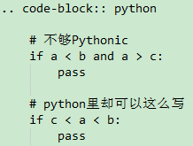
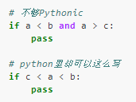
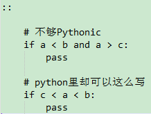

reStructuredText常用规则
===========================

.. contents:: 目录
.. section-numbering

1. 段落章节
-----------------------

章节是文章的主体结构, 分为 **标题 章 节 小节** 等. 定义章节的方式是在行的下面添加 '=======', 比如::

	大标题
	======================

	小标题
	-----------------------    

	二级标题
	^^^^^^^^^^^^^^^^^^^^^^   

	三级标题
	""""""""""""""""""""""""

	章
	-------------------------

	节
	~~~~~~~~~~~~~~~~~~~~~~~~

	小节
	#########################

说明 [1]_:

 1. 符号行至少和文字行一样长, 更长也行

 #. 相同级别必须使用统一的符号, 否则会被识别为更小的级别
 
 #. =  -  ~  `  :  '  "  ^  _  *  _  #  <  > 
    这些符号都可以, 级别足够多了.

.. [1] 由于幻灯片系统的限制, 效果无法在幻灯片内演示

2. 字体
-----------------------

 - \*斜体\*.  被\*包围的文字会变成 *斜体*
 - \**粗体**.  被\**包围的文字会变成 **粗体**
 - \``红色字体块\`` 被\``包围的字会被变成 ``红色字体块``

注意: 符号外侧必须留有空格, 英文标点符号. 

3. 嵌入程序代码
-----------------------

- 在引用代码前段落的末尾添加两个冒号，然后代码段换行缩进，直到不缩进为止.         

- 在引用代码段的前端使用  `.. code-block:: python`  (python根据代码语言替换，如shell，java, go), 然后代码段缩进，直到不缩进为止。

最后生成

- 在引用代码段的前端使用( \:: ),然后代码段缩进，直到不缩进为止。

		
最后生成

- 如果是单句代码，可使用 \` 代码 \` 引用::

	`from __future__ import absolute_import` 
	
效果：
	
	`from __future__ import absolute_import` 

4. 插入图片
-----------------------

::

  .. figure:: pic/magic-2.png

     插图 6-1

实际输出：

.. figure:: pic/magic-2.png

   插图 6-1
   
 
5. 列表
-----------------------

列表前后, 以及条目之间必须有空行隔开. 列表下面可以插入任意的内容, 段落, 图片都可以, 只要他们的左侧和列表的第一个文字左对齐。第二条开始的后续条目可用 \# 开头，也可使用 "*" "+" "-" 代替数字，第一条的序号不必从 1 开始::

 3. 第三条
 
 #. 第四条
 
 7. 重新设定序号
 
 #. 继续

效果:

 3. 第三条
 
 #. 第四条
 
 7. 重新设定序号
 
 #. 继续

::

 * 列表第一级

   + 第二级

     - 第三级

   + 第二级的另一个项目

效果:

 * 列表第一级

   + 第二级

     - 第三级

   + 第二级的另一个项目

6. 表格
-----------------------

普通表格 
^^^^^^^^

::

 +------------+------------+-----------+
 | Header 1   | Header 2   | Header 3  |
 +============+============+===========+
 | body row 1 | column 2   | column 3  |
 +------------+------------+-----------+
 | body row 2 | Cells may span columns.|
 +------------+------------+-----------+
 | body row 3 | Cells may  | - Cells   |
 +------------+ span rows. | - contain |
 | body row 4 |            | - blocks. |
 +------------+------------+-----------+

普通表格 生成:

 +------------+------------+-----------+
 | Header 1   | Header 2   | Header 3  |
 +============+============+===========+
 | body row 1 | column 2   | column 3  |
 +------------+------------+-----------+
 | body row 2 | Cells may span columns.|
 +------------+------------+-----------+
 | body row 3 | Cells may  | - Cells   |
 +------------+ span rows. | - contain |
 | body row 4 |            | - blocks. |
 +------------+------------+-----------+

简单表格
^^^^^^^^^

*注意:* 表格包含中文时,基本无法对齐,,,

::

 =====  =====  ====== 
    Inputs     Output 
 ------------  ------ 
   A      B    A or B 
 =====  =====  ====== 
 False  False  False 
 True   False  True 
 False  True   True 
 True   True   True 
 =====  =====  ======

简单表格  生成:

 =====  =====  ====== 
    Inputs     Output 
 ------------  ------ 
   A      B    A or B 
 =====  =====  ====== 
 False  False  False 
 True   False  True 
 False  True   True 
 True   True   True 
 =====  =====  ======

列表表格
^^^^^^^^

::

 .. list-table:: Frozen Delights!
   :widths: 15 10 30
   :header-rows: 1

   * - Treat
     - Quantity
     - Description
   * - Albatross
     - 2.99
     - On a stick!
   * - Crunchy Frog
     - 1.49
     - If we took the bones out, it wouldn't be
       crunchy, now would it?
   * - Gannet Ripple
     - 1.99
     - On a stick!

列表表格 生成:

.. list-table:: Frozen Delights!
   :widths: 15 10 30
   :header-rows: 1

   * - Treat
     - Quantity
     - Description
   * - Albatross
     - 2.99
     - On a stick!
   * - Crunchy Frog
     - 1.49
     - If we took the bones out, it wouldn't be
       crunchy, now would it?
   * - Gannet Ripple
     - 1.99
     - On a stick!

7. 超链接
--------------------

::
	
	* `《PEP8.org》 <http://pep8.org/>`_
	* `《PEP 8 -- Style Guide for Python Code》 <https://www.python.org/dev/peps/pep-0008/>`_
	
效果：

* `《PEP8.org》 <http://pep8.org/>`_
* `《PEP 8 -- Style Guide for Python Code》 <https://www.python.org/dev/peps/pep-0008/>`_

8. 提示框
---------------------

::

    .. note:: This is note.(注解)

    .. attention:: Directives at large.(注意)

    .. warning:: This is warning.(警告)

    .. caution:: Don't take any wooden nickels.(警告)

    .. seealso:: This is seealso.(参见)

    .. danger:: Mad scientist at work!(危险)

    .. error:: Does not compute.(错误)

    .. hint:: It's bigger than a bread box.(提示)

    .. important:: 
      - Wash behind your ears.
      - Clean up your room.
      - Call your mother.
      - Back up your data.(重要)

    .. tip:: 15% if the service is good.(小技巧)

    .. admonition:: by the way

      You can make up your own admonition too.

效果如下：

.. note:: This is note.(注解)

.. attention:: Directives at large.(注意)

.. warning:: This is warning.(警告)

.. caution:: Don't take any wooden nickels.(警告)

.. seealso:: This is seealso.(参见)

.. danger:: Mad scientist at work!(危险)

.. error:: Does not compute.(错误)

.. hint:: It's bigger than a bread box.(提示)

.. important:: 
   - Wash behind your ears.
   - Clean up your room.
   - Call your mother.
   - Back up your data.(重要)

.. tip:: 15% if the service is good.(小技巧)

.. admonition:: by the way

   You can make up your own admonition too.

9. rst格式
-------------------
::

	.. include:: ../README.rst	在index.rst中添加其他rst文件
	.. contents:: 目录	       生成目录

参考
---------------
https://linuxtools-rst.readthedocs.io/zh_CN/latest/helloworld.html
https://www.jianshu.com/p/1885d5570b37
https://docutils.sourceforge.io/docs/user/rst/

