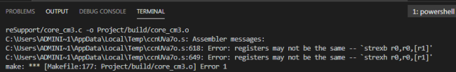

.. 标题文字下的符号长度都要大于标题长度

vscode使用过程中错误解决方案
==================================

* gcc编译STM32工程错误
--------------------------------

使用gcc编译工程时，出现如下错误：

解决方案：
   找到core_cm3.c文件，736行和753行分别修改为(增加取地址符&)。
   
	`__ASM volatile ("strexb %0, %2, [%1]" : "=&r" (result) : "r" (addr), "r" (value) );`
	`__ASM volatile ("strexh %0, %2, [%1]" : "=&r" (result) : "r" (addr), "r" (value) );`
	

  
* makefile中无法使用rm -Rf指令
--------------------------------

解决方案：
    是因为mingw中的make指令调用的是windows中的命令，需安装MSYS-1.0.10.exe，并将bin目录添加到环境变量中，从而使其调用linux环境下的命令。

