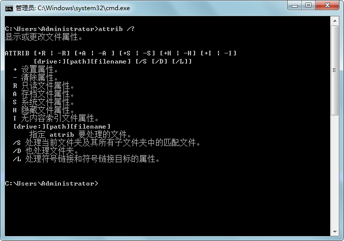
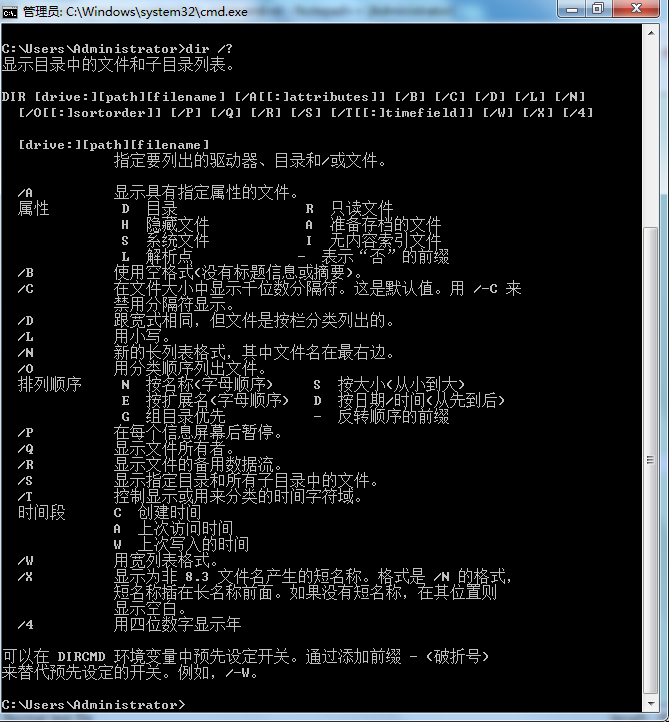

.. 标题文字下的符号长度都要大于标题长度

Windows bat批处理命令
==========================

1. attrib 
---------------------------------
显示或更改文件属性。

  
  
2. dir /x 
-------------------------------
显示长文件名的缩短名

  
3. del /f /a /q \\?\%1rd /s /q\\?\%1 
-------------------------------------------
用于删除长文件名文件。 

4. 批处理延时启动
-------------------------

- ping命令

缺点: 时间精度为1秒,不够精确

@echo off

@ping 127.0.0.1 -n 6 >nul

start gdh.txt

- vbs start /wait

缺点：生成临时文件

优点：时间精度为0.001秒，精度高

@echo off

echo wscript.sleep 5000>sleep.vbs

start /wait sleep.vbs

start gdh.txt

del /f /s /q sleep.vbs

- vbs cscript

@echo off

echo wscript.sleep 5000>sleep.vbs

@cscript sleep.vbs >nul

start gdh.txt

del /f /s /q sleep.vbs

- choice

优点：时间精确，CPU占用低，是最佳选择

@echo off

choice /t 5 /d y /n >nul

start gdh.txt

- for+set+if，时间精度为0.01秒

缺点：CPU占用高，语句过长，不常用

@echo off

setlocal enableextensions

echo %time%

call :ProcDelay 500

echo %time%

start gdh.txt

:ProcDelay delayMSec_

setlocal enableextensions

for /f "tokens=1-4 delims=:. " %%h in ("%time%") do set start_=%%h%%i%%j%%k

:_procwaitloop

for /f "tokens=1-4 delims=:. " %%h in ("%time%") do set now_=%%h%%i%%j%%k

set /a diff_=%now_%-%start_%

if %diff_% LSS %1 goto _procwaitloop

endlocal & goto :EOF

